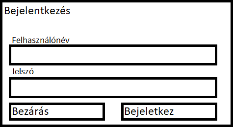
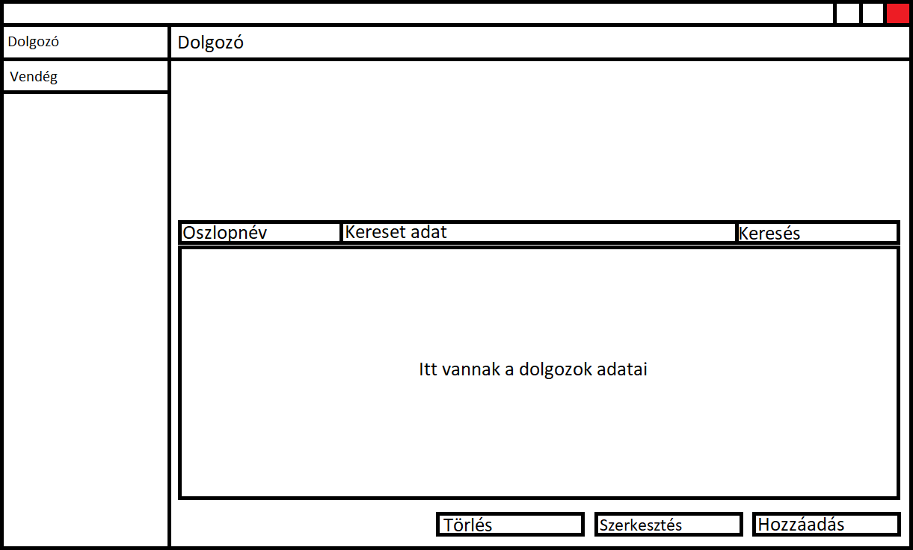
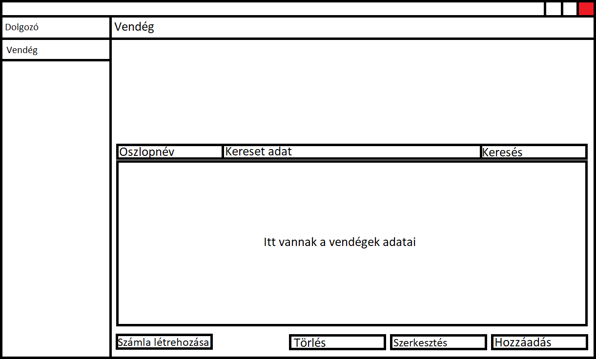
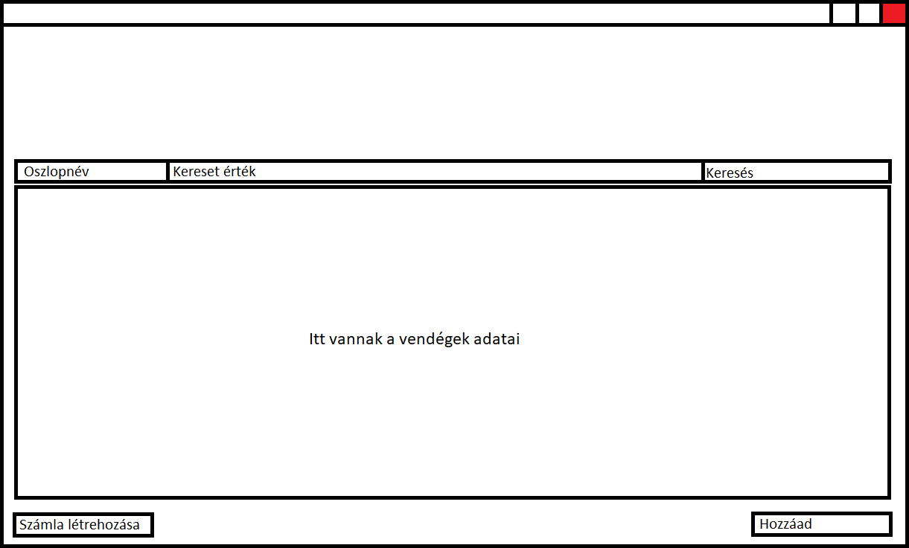
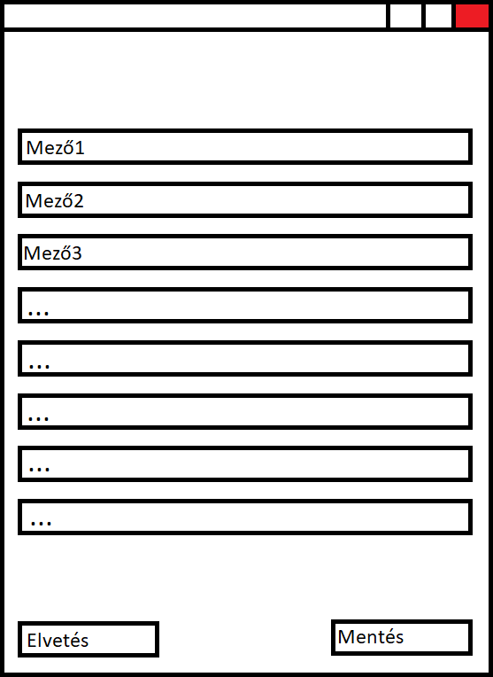

# Funkcionális specifikáció

## 1. Bevezetés

Egy Balaton parti panzió nagy forgalommal jár, az emberek szívesebben jönnek egy meghitt,
  családias hangulatú helyre nyaralni. Eddig a vendégeink listájat és adatait erre a célra használt könyvekben,
  füzetekben tároltuk. Napjainkban azonban, hogy versenyképesek tudjunk maradni nyitnunk kell a modern technológia felé.
  Éppen ezért a vezetés engyhangúan úgy döntött, hogy alkalmazkodik az új követelményekhez,
  és egy gyors és hatékony számítógépes rendszerre cseréljük a hagyományos, papír alapú könyvelést.
  Ehhez szükség lenne egy alkalmazásra amely akár több munkaállomáson is futhat de mégis egy és ugyan azon
  adathalmazt éri el. Ehhez tudunk biztosítani egy központi gépet amelyhez a munkaállomásoknak hozzáférést biztosítunk.
  Ilyen módon növelhetjük a hatékonyságunkat mivel egyszerre több vendéggel is foglalkozhatunk párhuzamosan. 
  Mivel a projekt kezdeti stádiumban van elsőnek a legfontosabb funkciók fejlesztése fog megtörténni, 
  majd a visszajelzések alapján priorizáljuk a további featureöket a felhasználói igények alapján.
  
## 2. Használati esetek

A Követelmény specifikáció 'Követelménylista' című bekezdése alapján az egyes pontok kifejtésére kerül sor ebben a fejezetben.

* Egy rendszer képes a dolgozok adatainak tárolására:
A programmal lehetőséget szeretnénk nyújtani a panzióban dolgozó alkalmazottak nyilvántartására.

* Egy rendszer ami nyilvántartja a panzióban megszállt vendégeket:
A programmal lehetőséget szeretnénk nyújtani a panzióban megszállt vendégek nyilvántartására. 
Továbbá a panzióban dolgozó személyzet számára szeretnénk átláthatóbbá tenni az adminisztrációt. 
Akár több munkaállomáson is futhat de mégis egy és ugyan azon adathalmazt éri el, így növelve a hatékonyságot.

* Egy rendszer ami képes két felhasználótípus megkülönböztetésére, adminisztrátor és dolgozó:
A programmal azt is szeretnénk elérhetővé tenni, hogy kettő felhasználói típust is meg lehessen különböztetni.
Ennek azért van jelentősége, mert a dolgozó csak a vendégek, míg az admin a dolgozók adatait is módosíthatja.
Tehát mind a kettő táblában képes adatot felvenni, keresni, szerkeszteni vagy törölni.

* A rendszer dolgozói felhasználója:
A a dolgozói felhasználó csupán három dolgot végezhet el a vendégek adataival.
Új vendéget vehet fel, kereshet a vendégek között és képes számlát kiállítani.

## 3. Jelenlegi helyzet

A jelenlegi rendszerünk, ami papíron és ceruzán alapuló nyilvántartó rendszer megérett arra, hogy egy modernebb egyszerűbb a huszonegyedik századhoz méltóra cseréljük. Valójában erre a döntésre azért is szántuk el magunkat, hogy a jelenlegi munkánkat megkönnyítsük. Melesleg így a későbbiekben képesek lehetünk tartani a konkurens panziókkal a versenyt és gyorsabban kiszolgálni a szolgáltatásainkat igénybevevő vendégeket. Természetesen az sem mellékes, hogy ennek az újításnak köszönhetően gyorsabban letudjuk kérdezni az adatbázisból azt, hogy egy bizonyos vendég mikor és mennyi időt töltött nálunk valamint, hogy mikor is hagyta el a panziót. Ezek a folyamatok eddig hosszú perceket vettek el a recepciós és a vendégek idejéből is. Ami sajnos a mai rohanó világban tarthatatlan. Így ha akarjuk ha nem kényszerből is muszáj megváltozni a panzió jelenlegi rendszerét. Viszont mivel a diszkréció és a biztonság is elég fontos szempont és eddig sajnos a papír ceruza alapu rendszer esetén sok volt a biztonsági rés, hogy bármilyen probléma bekövetkezzen ezért úgy szeretnénk kivitelezni a rendszert, hogy a recepciós az alkalmazás használata során ne kapjon jogosúltságot arra, hogy a vendégek adatait kénye kedvére tudja módosítani. Ennek a kritériumnak eleget téve úgy gondoltuk, hogy létrehozunk egy adminisztrátor jogosúltsággal rendelkező felhasználót az alkalmazásban aki képes arra, hogy az adatokat módosíthatja. Ezt a lépést azért tettük meg, hogy a vendégek adatai diszkréten legyen kezelve valamint a biztonság sem elhanyagolható abból a szempontból sem, hogy a számla kiállítása esetén a vendég valós adatai szerepeljenek ott.

### 3.1. A rendszernek NEM célja

 * Ez a program nem speciálisan a vendégek részére készül, hanem a személyzet részére, hogy megkönnyítsük a mindennapi munkájukat. Valamint szeretnénk azt is kivitelezni, hogy könnyeben lehessen vezetni a panzió szolgáltatását igénybe vevő vendégek listáját és nem utolsó soron a számla kiállításában is szeretnénk olyan megoldást találni, hogy a rendszer automatikusan magától legenerálja a számlát és a recepciósnak csak ki keljen nyomtatni és aláírni ezzel is megkönnyítve a munkatársunk munkályát.
    
 * Ugyan úgy az sem célunk, hogy bárki nyilvánosan megtudja nézni a vendégek adatait mivel, ahogy említve is volt ez a személyzet számára készül. Ezért nagy hangsúlyt fektetünk a diszkrécióra és a biztonságra ennek köszönhetően a vendégek adatait úgy próbáljuk védeni, hogy külön egy megbízható személyt ruházunk fel olyan jogokkal, hogy a vendégek adatait módosítani tudja.
   
 * A legmodernebb biztonsági előírásoknak megfelelni. Ennek ellenére viszont vannak olyan alap biztonsági funkciók amit lehetetlen nem figyelembe venni ilyen például az is, hogy csak azok férjenek hozzá a vendégek adataihoz akinek engedélyezett. Ezt úgy próbáljuk megoldani, hogy a programba beépítünk egy beléptető rendszert aminek a segítségével megtudjuk akadályozni az illetéktelenek behatolását a rendszerbe.
 
 * A GDPR előírásainak megfelelni.

 ## 4. Jelenlegi üzleti folyamatok modellje

 A papír alapú rendszert egy relációs adatbázis váltja, aminek a segítségével a vendégek adatai tökéletesen tárolhatóak és könnyen lekérdezhetőek különböző szűrök segítségével. A program indítása után egy bejelentkező oldal fog megjelenni ahol meg kell adni a felhasználónevét és a jelszavát a munkatársnak majd a bejelentkezés gombra nyomva ellenőrzésre kerül, hogy valós adatokat adott-e meg. Ha valós adatok lettek megadva, akkor a felhasználó jogosultságától függően vagy az adminisztrátori felülelet vagy a dolgozói felülelet fogja fogadni a bejelentkezést megkisérlő személyt.

 - Az adminisztrátori felület esetén az alábbi menüpontok lesznek láthatóak:
   
    * Dolgozó
    * Vendég

Ha az adminisztrátori jogokkal rendelkező felhasználó a dolgozó menüpontot választja, akkor először is látni fogja az aktuális munkásokat és ezeknek a listáját tudja szerkeszteni, törölni valamint hozzá is tud adni új alkalmazottat.

A másik választási lehetőség a vendégek menüpont ami teljes egészében megegyezik a dolgozók felületével csak annyiban tér el, hogy egy új gomb is helyet kap aminek a neve a számla létrehozása. Ennek a gombnak az lesz a lényeges feladata, hogy kiállítson egy számlát egy adott vendégnek.

- Az dolgozói felület esetén az alábbi funkciókat lehetséges használni:
   
    * Vendég hozzáadása
    * Számla létrehozása

Akik nem rendelkeznek adminisztrátori jogokkal azoknak a bejelentkezés után ez a felület fog megjelenni. Itt lehetőség adódik új vendég hozzáadására valamint számla kiállítására. A hozzáadás gomb használata esetén bizonyos mezőket ki kell majd tölteni az aktuális vendég adataival kapcsolatban és csak ez után lehetséges majd a mentés gombra kattintani.

## 5. Igényelt üzleti folyamatok

A program inditása egy bejelentkező ablakkal indul. Belépés után a program alapvetően egy oldalsó menűsávból és egy funkcíó képernyőből áll. Az oldalsó menüsáv feladata, hogy konyedén tudjunk navigálni a különböző funkciók között, amit a funkcióképernyőn fog megjeleníteni a szoftver. A menüsávon jogosultságtól függően különböző funkciók érhetök el. Egy dolgozó számára lehetőség van vendég felvételére, keresésére illetve számla kiálítására. Ezzel szemben egy adminisztrátor jogkörrel rendelkező felhasználó képes új dolgozó felvételére, az adatok módosítására és törlésére, továbbá adminisztrátor jog kiosztására a dolgozók között. A program célja, hogy egy SQL alapú adatbázis előnyeit ki tudjuk használni SQL utasítások írása nélkül. Így a mi feladatunk, hogy az adatbázis fontosabb funkciói használatára lehetőséget biztosítsunk a felhasználók számára. 

A következő funkciók a fontosabbak:
* Hozzáadás
* Lekérdezés
* Módosítás
* Törlés

Ezen funkciók könnyed eléréséhez egy grafikus felületett biztosítunk, így megkönnyítve a program használatát a felhasználok részére. Az első említet funkció, a hozzáadás, egy új elem hozzáadását jelenti ahhoz a táblához, vendég vagy dolgozó. Új vendég megadásakor a név, a szoba száma, a szoba használatának kezdő időpontja mezők kitöltése kötelező, illetve minden vendég rendelkezni fog egy azonosítoval amit a szoftver general. Minden vendég felvételekor szerepelni fog, hogy melyik dolgozó vette fel a rendszerbe amit a program automatikusan fog meghatározni a belépet felhasználó alapján. másik három funkció az ezen hozzáadásokból létrejöt táblat fogja használni. A lekerdezés a táblában lévő adatok grafikus megjelenítését jelenti, illetve a lekért adattáblában való keresésre is lehetőséget ad. Továbbá lehetőség lesz az adatok módosítására és törlésére is (Ez csak az adminisztrátorok számára elérhető). A szerkesztésre egy vendég kiválasztásával majd a szerkesztés gomb megnyomásával lesz lehetőség. Ezáltal felugrik egy szerkesztés ablak amin keresztül módosithatjuk a kivánt adatokat. A törlés hasonlóan a szerkesztéshez zajlik, kiválasztunk egy vendéget majd a törlésgomb megnyomásával töröljük azt.

## 6. Képernyőtervek

Az alkalmazásnak próbáltunk a lehető legmegfelelőbb kinézetet megalkotni, amely megkönnyíti a használatot, viszont megjelenése igényes, modern hatást keltsen az alkalmazás használójának. Ehhez JavaFX 14-et használtunk amely lehetőséget adott nekünk a letisztult és átlátható design megalkotására és ugyanakkor rengeteg fontos és hasznos felhasználói eszköz megvalósítását egyszerűsíti. 

### 6.1. Bejelentkezés

A program egy bejelentkező abblakal fog indulni. Az ábrán látható, hogy itt meg kell adnunk a felhasználonevünket és jelszavunkat majd a bejelentkez gomb megnyomásával belépünk a programba. Amenyiben mégsem szeretnénk bejelentkezni lehetőségünk van a kilépésre a Bezárás gombal. A bejelentkezés gomb lenyomása után felhasználó jogosultságától függően vagy az adminisztrátor vagy a dolgozói felület fog megjelenni.

    
    
A kép csak szemléltetés céljából készült, NEM a végleges kinézet a grafikus felületnek.

### 6.2. Adminisztrátori felület

A bejelentkezés után amenyiben rendelkezünk adminisztrátori jogosultsággal egy oldalsó menüsávot fogunk látni mellete pedig egy munkaterületet. A menüsávon két menüpont található, a dolgozó és a vendég. Az első képen a dolgozó menüpontot választotuk ki. Itt láthatjuk, hogy van egy táblázatunk amiben az adatokat láthatjuk. Alapértelmezeten itt kiíratjuk az összes adatot ezért a könyebb keresés érdekébe lehetöség van, oszloponként, keresni a táblázatban. Ezt ugy tehetjük meg, hogy kiválasztjuk az oszlopot, beirjuk a kereset értéke és rákatintunk a keresés gombra, ezáltal lecsökentve a táblázatban szereplő adatok menyiségét. A képen alul további három gombot láthatunk Törlés, Szerkesztés, Hozzáadás. Az első kettő használatához az első lépes egy sor kiválasztása lesz a táblából. Ez egyszeruen az adot sor katintva tehetjük meg. Miutána a sort kijelöltük eldonthetjük, hogy töröljük-e vagy szerkeszteni kivánjuk az adott sort. A törléshez csak rá kell katintanunk a Törlés gombra és egy megerösités után töröltük is a kiválasztot elemet az adatbázisból. Amegyiben az előbb kiválasztot elemet szerkeszteni szeretnénk egyszerüen rá kell katintanunk a Szerkesztés gombra. Ez azt fogja eredményezni, hogy felugrik egy szerkesztés ablak amin belül a kívánt módositásokat végrehajthatjuk . A Hozzáadás gomb új elem hozzáadást fogja jelenteni az adatbázisunkba. Erre rákatintva megnyilik egy ablak amin belül felvehetjük a kivánt elemet. [(A szerkesztés és hozzáadáshoz tartozó ablak részletes kifejtés a 6.4. alfejezetben)](https://github.com/RaczDevelopment/SZFM_2020_14_RLK-Developmen-VendegNyilvantarto/blob/master/docs/funkspec.md#64-hozz%C3%A1ad%C3%A1sszerkeszt%C3%A9s)

    
    
A kép csak szemléltetés céljából készült, NEM a végleges kinézet a grafikus felületnek.

A második, Vendég menüpontot láthatjuk a második ábrán. Itt hasonló funkciókat láthatun amelyek ugyan azon elven működnek mint az elöző menüpontban lévök. Egy új gombot azonban található itt Számla létrehozás néven. Ennek a feladata, hogy kiálitson egy számlát egy adott vendégnek.

    
    
A kép csak szemléltetés céljából készült, NEM a végleges kinézet a grafikus felületnek.

### 6.3. Dolgozói felület

Ezt a fületet azok a dolgozók látják amelyek nem rendelkeznek adminisztrátori jogosultsággal. Dolgozó férhet hozzá a dolgozók adataihoz, nem szerkeszthetik nem módosithatnka azon. Számukra csupán a vendég adattábla áll rendelkezésükre és ennek manipulálása is csak limitált mértékben. Egy dolgozó láthatja a vendégek adatait, kereshet az adattáblában és hozzáadhat új adatot de nem módosihatja és törölheti azokat. Továbba képesek még számlát kiálítani barmely vendég számára. [(Az itt található funkciók a 6.2. alfejezetben leírt módon müködnek)](https://github.com/RaczDevelopment/SZFM_2020_14_RLK-Developmen-VendegNyilvantarto/blob/master/docs/funkspec.md#62-adminisztr%C3%A1tori-fel%C3%BClet)

    
    
A kép csak szemléltetés céljából készült, NEM a végleges kinézet a grafikus felületnek.

### 6.4. Hozzáadás/Szerkesztés

Ez az ablak a szerkesztés illetve a hozzáadás gombal jelenithető meg. Az ablakon két gombot találhatunk, Mentés és Elvetés. A Mentés gombra kattintva mentjük az új adatot az adathalmazba. Amenyiben mégsem szeretnénk hozzáadni vagy módosítani adatot akkor az Elvetés gombra kattintva egyszerüen bezárhatjuk az ablakot. A képen láthatunk még mezőket, ezeknek a száma az adattábla méretétől függöen változhat, amelyek az adatok megadására szolgálnak. Ha hozzáadni szeretnénk adatot akkor ezek a mezők üresek lesznek. Amenyiben viszont egy elemet szerkesztünk akkor az ablak a kiválasztot sor adatait fogja rndre betölteni.

    
    
A kép csak szemléltetés céljából készült, NEM a végleges kinézet a grafikus felületnek.

