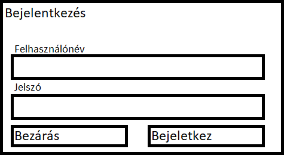

## 5. Igényelt üzleti folyamatok
A program inditása egy bejelentkező ablakkal indul. Belépés után a program alapvetően egy oldalsó menűsávból és egy funkcíó képernyőből áll. Az oldalsó menüsáv feladata, hogy konyedén tudjunk navigálni a különböző funkciók között, amit a funkcióképernyőn fog megjeleníteni a szoftver. A menüsávon jogosultságtól függően különböző funkciók érhetök el. Egy dolgozó számára lehetőség van vendég felvételére, keresésére illetve számla kiálítására. Ezzel szemben egy adminisztrátor jogkörrel rendelkező felhasználó képes új dolgozó felvételére, az adatok módosítására és törlésére, továbbá adminisztrátor jog kiosztására a dolgozók között. A program célja, hogy egy SQL alapú adatbázis előnyeit ki tudjuk használni SQL utasítások írása nélkül. Így a mi feladatunk, hogy az adatbázis fontosabb funkciói használatára lehetőséget biztosítsunk a felhasználók számára. 

A következő funkciók a fontosabbak:
* Hozzáadás
* Lekérdezés
* Módosítás
* Törlés

Ezen funkciók könnyed eléréséhez egy grafikus felületett biztosítunk, így megkönnyítve a program használatát a felhasználok részére. Az első említet funkció, a hozzáadás, egy új elem hozzáadását jelenti ahhoz a táblához, vendég vagy dolgozó. Új vendég megadásakor a név, a szoba száma, a szoba használatának kezdő időpontja mezők kitöltése kötelező, illetve minden vendég rendelkezni fog egy azonosítoval amit a szoftver general. Minden vendég felvételekor szerepelni fog, hogy melyik dolgozó vette fel a rendszerbe amit a program automatikusan fog meghatározni a belépet felhasználó alapján. másik három funkció az ezen hozzáadásokból létrejöt táblat fogja használni. A lekerdezés a táblában lévő adatok grafikus megjelenítését jelenti, illetve a lekért adattáblában való keresésre is lehetőséget ad. Továbbá lehetőség lesz az adatok módosítására és törlésére is (Ez csak az adminisztrátorok számára elérhető). A szerkesztésre egy vendég kiválasztásával majd a szerkesztés gomb megnyomásával lesz lehetőség. Ezáltal felugrik egy szerkesztés ablak amin keresztül módosithatjuk a kivánt adatokat. A törlés hasonlóan a szerkesztéshez zajlik, kiválasztunk egy vendéget majd a törlésgomb megnyomásával töröljük azt.

## 6. Képernyőtervek
Az alkalmazásnak próbáltunk a lehető legmegfelelőbb kinézetet megalkotni, amely megkönnyíti a használatot, viszont megjelenése igényes, modern hatást keltsen az alkalmazás használójának. Ehhez JavaFX 14-et használtunk amely lehetőséget adott nekünk a letisztult és átlátható design megalkotására és ugyanakkor rengeteg fontos és hasznos felhasználói eszköz megvalósítását egyszerűsíti. 
### 6.1 Bejelentkezés
A program egy bejelentkező abblakal fog indulni. Az ábrán látható, hogy itt meg kell adnunk a felhasználonevünket és jelszavunkat majd a bejelentkez gomb megnyomásával belépünk a programba. Amenyiben mégsem szeretnénk bejelentkezni lehetőségünk van a kilépésre a Bezárás gombal. A bejelentkezés gomb lenyomása után felhasználó jogosultságátol függöen vagy az adminisztrátor vagy a dolgozói felület fog megjelenni.

    

