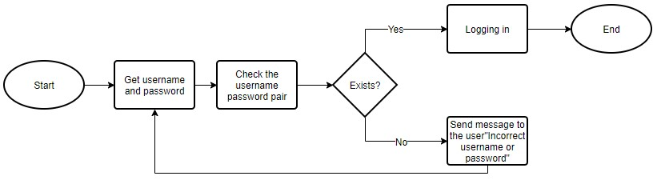
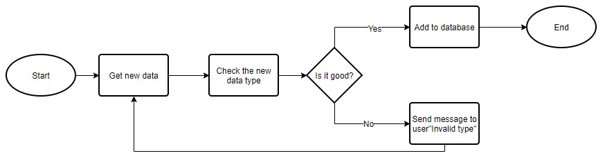
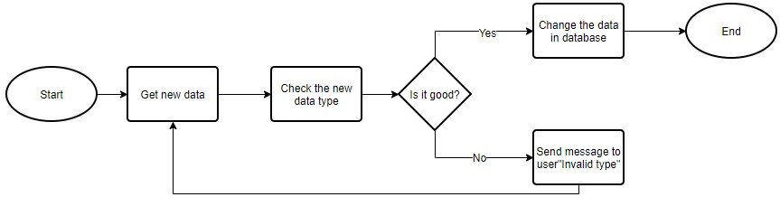
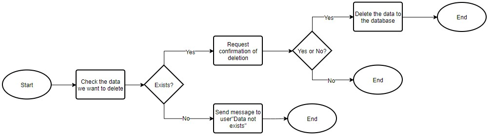
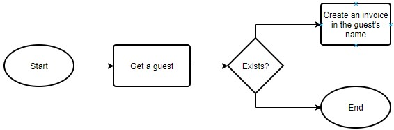
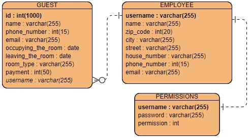

# Rendszerterv

## 1. Bevezetés

A rendszerterv elkészítésének célja az, hogy a program fejlesztői pontos, részletes és szaknyelvet tartalmazó leírással 
rendelkezzenek ami a rendszerrel kapcsolatos összes fontos szakmai kérdést magában foglalja. 
A szoftver egy Balaton parti panzió működését hivatott elősegíteni. Célja az analóg rendszer digitálisra cserélése 
ennek következtében a panzió befogadóképességét képes növelni és a dolgozók munkáját meggyorsítani. Adminisztratív és 
egyéb feladatokat lát el számítógépes környezetben. A cél platformunk a panzió tulajdonában lévő számítógépek melyek 
Windows operációs rendszert futtatnak. A megvalósítás miatt a program alkalmas lehet más operációs rendszer alatti 
futtatásra is, de ez nem elsődleges cél. A gépek hardverje 8 GB DDR4 -es RAMból, egy Intel Core i7-9750H 2.60GHz 
típusú processzorból és egy NVIDIA GeForce GTX 1660ti típusú videokártyából állnak. A gépek számára biztosítva van a 
stabil 20Mb/s sávszélességű internetelérés. Ezáltal a megfelelő infrastruktúra kiépítésével megvan teremtve a 
megfelelő háttér, hogy a dolgozók lehető legjobb hatásfokkal képesek legyenek használni a szoftvert. 
A rendszer felépítése egy Mysql alapokra épülő modell,egy közös sql adatbázis motorral rendelkező adatbázison, 
amely tárolja az elérhető szobákat, illetve a vendégek alapvetően szükséges adatait amely könnyű és egyszerű működésű 
lesz, hogy a panzió dolgozói kevés idő ráfordítás után is képesek legyenek átlátni a szoftvert és kényelmesen tudják 
használni azt. Ezért a tervezettek szerint olyan programozási nyelvet használunk ami megkönnyíti ennek a szoftvernek a 
leghatékonyabb lekódolását. Erről bővebben a Fejlesztő eszközök fejezetben lesz majd szó. A digitalizálás hatására 
sokkal gyorsabb, egyszerűbb és biztonságosabb lesz az új rendszer a régihez képest.

## 2. A rendszer célja

A rendszer célja, hogy a panzió elavult adminisztrációs módszerét felváltsa ez a 21. századi, adatbázissal 
rendelkező alkalmazás amivel a panzió adminisztrációs munkája gyorsabb, egyszerűbb és biztonságosabb lesz. 
A programot használó dolgozóknak nagyon sok ideje fel fog szabadulni a program gyorsasága miatt, így foglalkozhat 
más teendőkkel is akár, vagy több vendéget is tud kevesebb idő alatt adminisztrálni. Illetve így a panzióban dolgozó
magasabb beosztású személyeknek könnyebb dolga lesz a dolgozók adatainak kezelésével és nyílvántartásával.

## 3. A projekt tervezete

* 3.1. A rendszer felépítése
Az adatbázis kapcsolathoz szükséges egy adatbázis connection osztály,
amely létrehozza, fenntartja, és zárja az adatbáziskapcsolatot.
A rendszer fő pontja így a központi gép, amelyiken az SQL fut, illetve ettől elkülönített gépen is futtatható 
az SQL szerver amely az adatokat biztosítja. Javasoljuk a szerverek külön gépen futtatását, hogy egy esetleges 
hardverhiba esetén csak az egyik része károsodjon a rendszernek. A program controller részének megvalósítását 
Java programozási nyelven terveztük el. A projekthez továbbá felhasználtuk a Maven nevű projekt menedzsment 
eszköztárat is.

* 3.2. Projektmunkások és felelősségeik
A projektet készítő három személy teljesen egyenjogú szerepkörökkel rendelkezik. 
Mindhármuk kiveszi a részét a munka minden egyes fázisából és részéből, egyenrangú fejlesztői a programnak.

| Név                | Szerepkör         |
|--------------------|-------------------|
| Rácz András István | Szoftverfejlesztő |
| Ladik Balázs       | Szoftverfejlesztő |
| Kosztya Zoltán     | Szoftverfejlesztő |

## 4. Ütemterv

### 4.1 Mérföldkövek
A program elkészítésének fő mérföldkövei:

### 4.2 Első felvonás
* A git project használatának elkezdése
* A git repó elkészítése
* A tagok git-re való regisztrációja illetve a projekthez felvétele
* A követelményspecifikáció megírása
* A funckionális specifikáció megírása
* A rendszerterv megírása
* A program prototípus elkészítése
* Demo bemutatása a programról

### 4.3 Második felvonás
* A rendszer tesztjeinek felállítása
* A program adatbázisának elkészítése
* A program tesztelése a minimális funkciókkal

## 5. Üzleti szereplők  

Az elkészült programot az éppen munkaidejét töltő recepciós és adminisztrátor pozicióban alkalmazott felhasználó fogja használni. A panzió összes alkalmazotjának, akik ezen munkakörök valamelyikében dolgoznak megvan a végzettsége és a tudása ahhoz, hogy SZFM_2020_14_RLK-Development csapat által készített programot magabiztosan képes legyen használni.

### 5.1. Üzleti entitások  

Az üzletben résztvevő entitások:  
- A programot használó személyzet jogosultságától függően két csoportot különböztetünk meg az adminisztrátori jogokkal rendelkező valamint felhasználói jogokkal rendelkező csoportot  
- A panzió szolgáltatásait igénybe vett regisztrált vendégek  
- A panzióba még nem regisztrált, de majd regisztráló vendégek

## 6. Követelmények

### 6.1. Funkcionális követelmények

- Könnyen és egyszerűen kezelhető rendszer.
- Letisztult átlátható adatbázis kezelés.
- Egyszerű adatbázis lekérdezések megvalósítása.
- Könnyű egyszerű adatfelvétel és módosítás.
- Megkönnyített számla kiállítása.
- Biztonságos adatkezelés.
- Beléptető rendszer kiépítése.

### 6.2. Nem funkcionális követelmények

- Letisztult esztétikus felhasználói felület.
- Látás károsultak számára is megfelelő színvilág és betűméretek használata.
- Clean code-nak való megfelelés.

## 7. Funkcionális terv  

A program célja a vendégek regisztrációjának a felgyorsítása valamint a panzióban dolgozó személyzet
munkájának megkönnyebbítése. Valamint a jelenlegi analóg adminisztrációs módszer teljes lecserélése
digitális formára. A korábbi módszer minden 'funkciójának' átültetése számítógépes környezetbe.

Ezek a 'funkciók' nem mások, mint:

 - Bejelentkeztető rendszer.
 - Adminisztrátori felület.
 - Dolgozói felület.
 - Hozzáadás/Szerkesztés opciók.
 - A panzió vendégeinek nyílvántartása.
 - A kiadott szobák feljegyzése.
 - A vendégek kijelentkezésének időpontja.
 - Az igényelt szoba típusa.
 - Számla kiállítása.

### 7.1. Bejelentkeztető rendszer

A bejelentkeztető rendszer arra fog szolgálni, hogy a vendégek adatait diszkréten és biztonságosan tudjuk tárolni. A program inditása után mindig fog kérni egy felhasználónevet és egy jelszót annak a kiküszöbölése miatt, hogy illetéktelenek ne tudjanak hozzáférni a panzió vendégeinek az adataihoz.

### 7.2. Adminisztrátori felület

A bejelentkezés után ha az adott felhasználó rendelkezik adminisztrátori jogokkal, akkor fog megjelenni neki ez a felület. A felület tartalmaz egy Dolgozó menüpontot amin belül a dolgozók adatai láthatóak, szerkeszthetőek valamint hozzá is tudunk új dolgozót adni az adatbázishoz. A másik menüpont a vendég ahol hasonlóképpen a vendégek listáját fogjuk látni ezeket is tudjuk szerkeszteni törölni valamint új vendéget hozzáadni. A legfontosabb különbség az hogy itt lehetőség adódik arra is hogy számlát állítsunk ki a vendégek részére.

### 7.3. Dolgozói felület

Ez a felület azon dolgozók részére lesz látható akik nem rendelkeznek adminisztrátori jogokkal. Ezen a felüleleten az alkalmazott hozzá tud adni az adatbázishoz új vendégeket valamint kitudja választani a listából a vendégeket és számlát tud kiállítani részükre.

### 7.4. Hozzáadás/Szerkesztés opciók

Ez a rész a szerkesztés illetve a hozzáadás gombok használatával jeleníthető meg a program használata során. Ha rákattintunk ezek küzül valamelyikre akkor utána fogunk látni pár mezőt ahova meg kell adni az adott vendég adatait akit hozzá szeretnénk adni az adatbázishoz. Ezek után egyértelműen a mentés gombra kell majd nyomni, hogy a megadott adatok bekerüljenek a rendszerbe. Viszont ha esetleg az adatok beírása után mégis meggondolnánk magunkat és nem szeretnénk hozzáadni a vendéged az adatbázishoz akkor lehetőségünk adódik arra hogy az elvetés gomb megnyomásával visszatérjünk az előző menüpontba.

### 7.5. Számla kiállítása

A számla kiállítása opció arra fog szolgálni, hogy megkönnyítsük az aktuális munkaidejét töltő munkatársunk munkáját azzal, hogy a rendszer automatikusan legenerálja a számlát és nem kell a régi elavult módszerekhez ragaszkodni amikor is még papíron kellet kitölteni a számlát. A rendszer úgy van megtervezve, hogy az adatbázisból automatikusan kiveszi az aktuális vendég adatait és azt jeleníti meg a számlán.

## 8. Rendszerszereplők  

A rendszerben két féle entitás csoportot különböztetünk meg.

A két csoport:
- Személyzet csoportja
- Vendégek csoportja

A programot a személyzet csoportja fogja használni viszont a személyzet csoporton belül megkülönböztetünk két külön jogosultsági körrel rendelkező csoportot. Az egyik ilyen csoport az adminisztrátori jogokkal rendelkező a másik a felhasználói jogokkal rendelkező. Erre azért volt szükség, hogy biztonságosan tudjuk kezelni a vendégek személyes adatait. Viszont attól, hogy a személyzet csoportot megkülönböztetjük jogosultságuk alapján attól még mindig egyfajta szolgáltatást
nyújtanak a vendégek csoportjának.

A személyzet csoportján belül az adminisztrátori jogokkal rendelkezőknek sokkal több joga lesz mint a felhasználói jogokkal rendelkezőknek. Viszont ha azt nézzük a vendégek nem is használhatják
a programot vagyis a felhasználói jogokkal rendelkezők is több joggal rendelkeznek mint a vendégek. Ezek mellett a felhasználói jogokkal rendelkező munkatársaknak a feladatai közé tartozik az is, hogy a kapcsolatot fenntartják a vendégekkel.
Valamint a feladatuk kiterjed a törzsvendégek értesítésére szezonális kedvezmények esetén.

## 9. Rendszerhasználati esetek és lefutásai

### 9.1. Bejelentkezés

A program elinditásakor egy bejelentkező ablak fogad minket elsőnek. Ide meg kell adnunk a felhasználónevünket és jelszavunkat. Ezután ha rákattintunk a Bejelentkezés gombra a program megkapja a felhasználónév jelszó párt és megkeresi az adatbázisban. Amenyibe létezik ez a pár sikeresen beléptünk a programba. Ellenkező esetben pedig a "Hibás jelszó vagy felhasználonév üzenetet kapjuk."

    
    
A kép szemlélteti a bejelentkezés lefutásának menetét.

### 9.2. Adat hozzáadása

Adat hozzáadása esetén meg kell adnunk az új adatokat ezt a program ellenörzi és amenyiben minden típus megfelelönek bizonyult a hozzáadás megtörténik. Abban az esetben ha típushibát észlel a szoftver egy felugró ablak keretén belül értesitést kapunk erről amit le okézva a hozzáadás ablakra térhetünk vissza.

    
    
A kép szemlélteti az új adat hozzáadás lefutásának menetét.

### 9.3. Adat módosítása

Egy adat módosításakor a módosítani kívánt egye betöltésre kerül a szerkesztés ablakban. Itt kiválasztjuk és módositjuk azt az adatot/adatokat amelyeket szeretnénk és a mentés gombra kattintunk. Ekkor amenyiben megfelelő típusu adatokat adtunk meg az adatok módosulnak az adathalmazban. Amenyiben hiba lép fel egy felugro abblak figyelmeztet minket amit le okézva a szerkesztés ablakra térhetünk vissza.

    
    
A kép szemlélteti a módosítás lefutásának menetét.

### 9.4. Adat törlése

Törléskor ki kell választanunk egy sort a táblából amit törölni szeretnénk majd a Törlés gombra kattintunk. Amenyiben az adat létezik egy megerősítés után az adat törlödik is az adatbázisból. Ha nem választotunk ki vagy nem létezik az adat hiba üzenetet kapunk és nem hajtódik végre törlés.

    
    
A kép szemlélteti a törlés lefutásának menetét.

### 9.5. Számlakiálítása

Számlakiálításkor ki kell választanunk egy sort a táblából akinek a nevére ki szeretnénk állítani a számlát. Amenyiben az adat létezik a számla kiálítása megtörténik. Ha nem választotunk ki vagy nem létezik az adat hiba üzenetet kapunk és nem hajtódik végre a számla kiálítás.

    
    
A kép szemlélteti a számlakiálítás lefutásának menetét.

### 9.6. Hardver és hálózati topológia

A felhasználói gépeknek el kell érniük az adatbázis szerverként üzemelő központi gépet, mivel a dolgozók a szoftveren keresztül az itt tárolt adatokat fogják elérni. A cél platformunk a panzió tulajdonában lévő számítógépek melyeknek hardvere 8 GB DDR4 és RAM-ból, egy Intel Core i7-9750H 2.60GHz típusú processzorból és egy NVIDIA GeForce GTX 1660ti típusú videokártyából állnak, de ennek ellenére a szoftverunket úgy terveztük, hogy bármely 2000 után piacra dobot számítógépen el tudjon futni. Ezeken Windows 10 operációs renszer fut. A programunk viszont fut linux alapu operációs rendszerek alatt is. 

## 10. Fejlesztő eszközök

A projektet Java 14-be készítetük aminek projektmenedzsmentjéhez az Apache Maven használtuk. A grafikus felületet JavaFX 14-be készítettük. A szoftver által használt adatbázis MySQL alapú relációs adatbázis.

## 11. Architekturális terv 

A rendszert felépítő alrendszerek (szoftver komponensek) lényegében a Java, Sql, Mavan használata Java FX keretén belül. Az alrendszerek meghatározása után a tulajdonságaikat kiaknázva vezérlési, valamint kommunikációs kapcsolatokat lehet létrehozni ezáltal. Ezeknek a komponenseknek és a köztük fennáló kapcsolatok alkotják a szoftver architektúráját. A rendszer szerepe az érdekelt szereplő kommunikációjának lehetővé tétele, a korai fejlesztési fázisok döntéseinek támogatása. Emelett fontos az újrafelhasználhatóság elősegítése. Ennek meghatározásában nagy szerepet játszik a környezet, a fejlesztők céljai és stratégiája által befolyásolt követelmények. De mint minden tervnek ennek is megvannak a meghatározó pillérjei:

* Architektúrát meghatározó fejlesztő szervezet szerkezetéből
* Szereplők
* Követelmények
* Technológiai környezet
* A tervező tapasztalata
  
Architektúra elemek:

* Architektúrális minta
   * típus elemek és kapcsolatok, kényszerek
   * pl. kliens-szerver minta
*  Referencia modell
   * standard funkcionális felosztás és adatfolyam megoldások
   * pl. adatbázis kezelő rendszer
* Referencia architektúra
   * referencia modell leképezése szoftver elemekre
   * pl. ISO OSI architektúra

### 11.1. Rendszer bővíthetősége  

A rendszer teljesen objektum orientált szemlélet szerint kerül implementálásra vagyis a rendszer egy bizonyos szinten alkalmas lesz a bővítésre.

### 11.2. Biztonsági funkciók 

A szoftverben biztonsági funkciók implementálását nem terveztük.

### 11.3. Adatbázis terv

Az alkalmazásunk egy MySQL alapú adatbázist fog kezelni. Ez az adatbázis egy táblából, a Vendég táblából fog állni. Ez a tábla tartalmazni fogja a vendégek nevét, telefonszámát, email címét, a szoba kivételének dátumát, a szoba elhagyasának dátumát, a szoba típusát(1, 2 vagy 3 ágyas) illetve a vendég által fizetendő összeget.

### 11.4. Logikai adatmodell

A szoftver három táblát kezel, két nagyobbat és egy kisebbet. Az első nagy tábla tartalmazza a panzióban megszáló vendégekkel kapcsolatos adatokat, név, telefonszám, email, hogy melyik szobát, mettől, meddig vették ki, menyit fizetek és melyik dolgozó fogadta őket. Itt még található egy automatikusan generált id is ami az elsődleges kulcsot képzi. A második nagyobban találhatóak az alkalmazotak neve, címe és elérhetőséguk illetve egy felhasználónév ami elsődleges kulcsként funkciónál továbbá ezzel tudnak bejelentkezni a szoftverbe. A harmadik kisebb tábla az alaklmazotakat tartalmazó táblát bővíti, ebbe megtalalhatjuk minden dolgozó felhasználónevét a vele párba állított jelszóval, ami a bejeletkezéshez való azonosításra szolgál. Továbbá itt szerepel az adott dolgozó jogoultsági szintje is. 

    
    
A kép látható az adatbázis modell a kapcsolatokkal.

## 12. Implementációs terv

A tervezési folyamat során célszerű vagy mondhatjuk úgy, hogy ajánlott az általános logikai felépítést mindig valamilyen 
grafikus reprezentációval
modellezni, mert az emberi agy vizualizált objektumokkal könnyebben dolgozik.
Az UML (=Unified Modeling Language), modellező nyelv segítségével a specifikációt és 
a tervezést is grafikus
formában, diagramok segítségével tudjuk dokumentálni. A követelményspecifikációban a használati
esetdiagramokat (use case), az adatbázis tervezésnél az adatbázis diagramot, az OOP 
tervezésnél az
osztálydiagramot és objektumdiagramot valamint a szekvenciadiagramot, aktivitásdiagramot
használhatjuk.

### 12.1. Perzisztencia-osztályok 

A perzisztencia megvalósításáért a Hibernate objektum-relációs leképezést
megvalósító programkönyvtár felel.

Perzisztencia osztályok:
- DBUtils
- HibernateUtils

### 12.2. Üzleti logika osztályai  

Az üzleti logika a háromrétegű adatkezelő alkalmazások középső rétege, amely meghatározza 
az alkalmazás működésének logikáját.
A háromrétegű architektúra az alkalmazást három különálló rétegre osztja fel. E rétegek 
komponensei önállóan léteznek, és együttműködésük során egyidejűleg több különböző 
alkalmazásnak is a részei lehetnek.
Az adatbázislogika az adatok nyers tárolását végzi. Semmilyen információval nem rendelkezik 
az adatok feldolgozásával vagy megjelenítésével kapcsolatban.
Az ügyviteli (üzleti) logika az alkalmazás logikáját, működési szabályait határozza meg. 
Semmilyen információval nem rendelkezik az adatok tárolásával vagy megjelenítésével kapcsolatban.
A felhasználói interfész feladata az ügyviteli logika által küldött adatok formázása és
megjelenítése. Biztosítja a felhasználó hozzáférését az ügyviteli logika szolgáltatásaihoz. 
Sohasem kerül közvetlen kapcsolatba az adatbázissal, és nem végez semmilyen műveletet az 
adatokon.

## 13. Tesztterv

Kód|Leírás|  
----|---  
T-01| A program elindítása.|
T-02| Program bezárása a Kilépés gombal a bejelenkező ablakon.|
T-03| Hibaüzenet kapása hibás felhasználónév esetén.|
T-04| Hibaüzenet kapása hibás jelszó esetén.|
T-05| Sikeres admin belépés a megfelelő felhasználonév, jelszó párral.|
T-06| Sikeres dolgozó belépés a megfelelő felhasználonév, jelszó párral.|
T-07| Dolgozó felület inditása sikeres dolgozó bejelentkezés után.|
T-08| Teljes vendég adatbázis lekérdezés dolgozói felületből.|
T-09| Keresés adott értékre a vendég adatbázisban dolgozói felületből.|
T-10| Hibaüzenet kapása nem megfelelő típusu adatt keresése esetén dolgozói felületen.|
T-11| Hozzáadáas ablak megnyílk a Hozzáadás gombra kattintva dolgozói felületen.|
T-12| A fő abblak szerkeszthetetlen amig a hozzáadáas ablak él.|
T-13| A hozzáadás ablak bezárása az elvetés gomb megnyomsakor.|
T-14| A hozzáadás megtörténik a vendég táblába a mentés gombra kattintva.|
T-15| A hozzáadás nem történik meg a vendég tábláb hibás adat esetén.|
T-16| Hozzáadáskor hibás adat esetén hibaüzenetet kapunk.|
T-17| Vendég kiválasztása dolgozói felületből.|
T-18| Számla kiálítása adtott vendég részére dolgozói felületben.|
T-19| Számla nem álítodik ki ha nincs kiválasztva vendég.|
T-20| Számla nem állítható ki a vendégnek aki még nem hagyta el a szobát.|
T-21| Sikeretelen számla kiállításkor hibaüzenetet kapunk dolgozói feluleten.|
T-22| Dolgozó felületen azonosító szerinti rendezes növekvő sorrendbe a vendég táblában.|
T-23| Dolgozó felületen azonosító szerinti rendezes csökkenő sorrendbe a vendég táblában.|
T-24| Dolgozó felületen vendég neve szerinti rendezes növekvő sorrendbe a vendég táblában.|
T-25| Dolgozó felületen vendég neve szerinti rendezes csökkenő sorrendbe a vendég táblában.|
T-26| Dolgozó felületen telefonszám szerinti rendezes növekvő sorrendbe a vendég táblában.|
T-27| Dolgozó felületen telefonszám szerinti rendezes csökkenő sorrendbe a vendég táblában.|
T-28| Dolgozó felületen email szerinti rendezes növekvő sorrendbe a vendég táblában.|
T-29| Dolgozó felületen email szerinti rendezes csökkenő sorrendbe a vendég táblában.|
T-30| Dolgozó felületen szoba kivételének dátum szerinti rendezes növekvő sorrendbe a vendég táblában.|
T-31| Dolgozó felületen szoba kivételének dátum szerinti rendezes csökkenő sorrendbe a vendég táblában.|
T-32| Dolgozó felületen szoba elhagyésénak dátum szerinti rendezes növekvő sorrendbe a vendég táblában.|
T-33| Dolgozó felületen szoba elhagyésénak dátum szerinti rendezes csökkenő sorrendbe a vendég táblában.|
T-34| Dolgozó felületen szoba típusa szerinti rendezes növekvő sorrendbe a vendég táblában.|
T-35| Dolgozó felületen szoba típusa szerinti rendezes csökkenő sorrendbe a vendég táblában.|
T-36| Dolgozó felületen fizetendő összeg szerinti rendezes növekvő sorrendbe a vendég táblában.|
T-37| Dolgozó felületen fizetendő összeg szerinti rendezes csökkenő sorrendbe a vendég táblában.|
T-38| Dolgozó felületen dolgozó neve szerinti rendezes növekvő sorrendbe a vendég táblában.|
T-39| Dolgozó felületen dolgozó neve szerinti rendezes csökkenő sorrendbe a vendég táblában.|
T-40| Dolgozói felület bezárása.|
T-41| Admin felület inditása sikeres admin bejelentkezés után.|
T-42| Dolgozók menüpont elérése adminisztrátori felületből.|
T-43| Vendég menüpont elérése adminisztrátori felületből.|
T-44| Teljes vendég adatbázis lekérdezése adminisztrátori felületből.|
T-45| Keresés adott értékre a vendég adatbázisban adminisztrátori felületből.|
T-46| Hibaüzenet kapása nem megfelelő típusu adatt keresése esetén a vendég adatbázisban adminisztrátori felületen.|
T-47| Hozzáadáas ablak megnyílk a Hozzáadás gombra kattintva az adminisztrátori felületen vendég menüpontjában.|
T-48| Vendég kiválasztása adminisztrátori felületből.|
T-49| Számla kiálítása adtott vendég részére adminisztrátori felületben.|
T-50| Sikeretelen számla kiállításkor hibaüzenetet kapunk adminisztrátori felületen.|
T-51| Adminisztrátori felületen azonosító szerinti rendezes növekvő sorrendbe a vendég táblában.|
T-52| Adminisztrátori felületen azonosító szerinti rendezes csökkenő sorrendbe a vendég táblában.|
T-53| Adminisztrátori felületen vendég neve szerinti rendezes növekvő sorrendbe a vendég táblában.|
T-54| Adminisztrátori felületen vendég neve szerinti rendezes csökkenő sorrendbe a vendég táblában.|
T-55| Adminisztrátori felületen telefonszám szerinti rendezes növekvő sorrendbe a vendég táblában.|
T-56| Adminisztrátori felületen telefonszám szerinti rendezes csökkenő sorrendbe a vendég táblában.|
T-57| Adminisztrátori felületen email szerinti rendezes növekvő sorrendbe a vendég táblában.|
T-58| Adminisztrátori felületen email szerinti rendezes csökkenő sorrendbe a vendég táblában.|
T-59| Adminisztrátori felületen szoba kivételének dátum szerinti rendezes növekvő sorrendbe a vendég táblában.|
T-60| Adminisztrátori felületen szoba kivételének dátum szerinti rendezes csökkenő sorrendbe a vendég táblában.|
T-61| Adminisztrátori felületen szoba elhagyésénak dátum szerinti rendezes növekvő sorrendbe a vendég táblában.|
T-62| Adminisztrátori felületen szoba elhagyésénak dátum szerinti rendezes csökkenő sorrendbe a vendég táblában.|
T-63| Adminisztrátori felületen szoba típusa szerinti rendezes növekvő sorrendbe a vendég táblában.|
T-64| Adminisztrátori felületen szoba típusa szerinti rendezes csökkenő sorrendbe a vendég táblában.|
T-65| Adminisztrátori felületen fizetendő összeg szerinti rendezes növekvő sorrendbe a vendég táblában.|
T-66| Adminisztrátori felületen fizetendő összeg szerinti rendezes csökkenő sorrendbe a vendég táblában.|
T-67| Adminisztrátori felületen dolgozó neve szerinti rendezes növekvő sorrendbe a vendég táblában.|
T-68| Adminisztrátori felületen dolgozó neve szerinti rendezes csökkenő sorrendbe a vendég táblában.|
T-69| Kiválasztott vendég törlése a vendég táblából.|
T-70| Sikertelen törlés esetén hibüzenet.|
T-71| Szerkesztés abblak megnyitása kiválasztot vendégre.|
T-72| Szerkesztés bezárása az elvetés gombra kattintásal.|
T-73| A szerkesztés megtörténik a vendég táblába a mentés gombra kattintva.|
T-74| A szerkesztés nem történik meg a vendég tábláb hibás adat esetén.|
T-75| Szerkesztéskor hibás adat esetén hibaüzenetet kapunk.|
T-76| Teljes dolgozó adatbázis lekérdezése adminisztrátori felületből.|
T-77| Keresés adott értékre a dolgozó adatbázisban adminisztrátori felületből.|
T-78| Hibaüzenet kapása nem megfelelő típusu adatt keresése esetén a dolgozó adatbázisban adminisztrátori felületen.|
T-79| Hozzáadáas ablak megnyílk a Hozzáadás gombra kattintva az adminisztrátori felületen dolgozó menüpontjában.|
T-80| Dolgozó kiválasztása adminisztrátori felületből.|
T-81| Adminisztrátori felületen felhasználónév szerinti rendezes növekvő sorrendbe a dolgozó táblában.|
T-82| Adminisztrátori felületen felhasználónév szerinti rendezes csökkenő sorrendbe a dolgozó táblában.|
T-83| Adminisztrátori felületen dolgozó neve szerinti rendezes növekvő sorrendbe a dolgozó táblában.|
T-84| Adminisztrátori felületen dolgozó neve szerinti rendezes csökkenő sorrendbe a dolgozó táblában.|
T-85| Adminisztrátori felületen irányítószám szerinti rendezes növekvő sorrendbe a dolgozó táblában.|
T-86| Adminisztrátori felületen irányítószám szerinti rendezes csökkenő sorrendbe a dolgozó táblában.|
T-87| Adminisztrátori felületen város szerinti rendezes növekvő sorrendbe a dolgozó táblában.|
T-88| Adminisztrátori felületen város szerinti rendezes csökkenő sorrendbe a dolgozó táblában.|
T-89| Adminisztrátori felületen utca szerinti rendezes növekvő sorrendbe a dolgozó táblában.|
T-90| Adminisztrátori felületen utca szerinti rendezes csökkenő sorrendbe a dolgozó táblában.|
T-91| Adminisztrátori felületen házszám szerinti rendezes növekvő sorrendbe a dolgozó táblában.|
T-92| Adminisztrátori felületen házszám szerinti rendezes csökkenő sorrendbe a dolgozó táblában.|
T-93| Adminisztrátori felületen telefonszám szerinti rendezes növekvő sorrendbe a dolgozó táblában.|
T-94| Adminisztrátori felületen telefonszám szerinti rendezes csökkenő sorrendbe a dolgozó táblában.|
T-95| Adminisztrátori felületen email összeg szerinti rendezes növekvő sorrendbe a dolgozó táblában.|
T-96| Adminisztrátori felületen email összeg szerinti rendezes csökkenő sorrendbe a dolgozó táblában.|
T-97| Kiválasztott dolgozó törlése a dolgozó táblából.|
T-98| Szerkesztés abblak megnyitása kiválasztot dolgozóra.|
T-99| A szerkesztés megtörténik a dolgozó táblába a mentés gombra kattintva.|
T-100| A szerkesztés nem történik meg a dolgozó tábláb hibás adat esetén.|
T-101| A főablak szerkeszthetetlen amig a szerkesztés ablak aktív.|
T-102| A bejelentkezés ablak grafikus felülete szerkeszthetetlen,|
T-103| A dolgozói felület reszponzív az ablak átméretezésre.|
T-104| Az adminisztrátori felület menüsávja reszponzív az ablak átméretezésre.|
T-105| Az adminisztrátori felület vendég menüpontja reszponzív az ablak átméretezésre.|
T-106| Az adminisztrátori felület dolgozó menüpontja reszponzív az ablak átméretezésre.|
T-107| A szerkesztés/hozzáadáas ablak reszponzív az átméretezésre.|